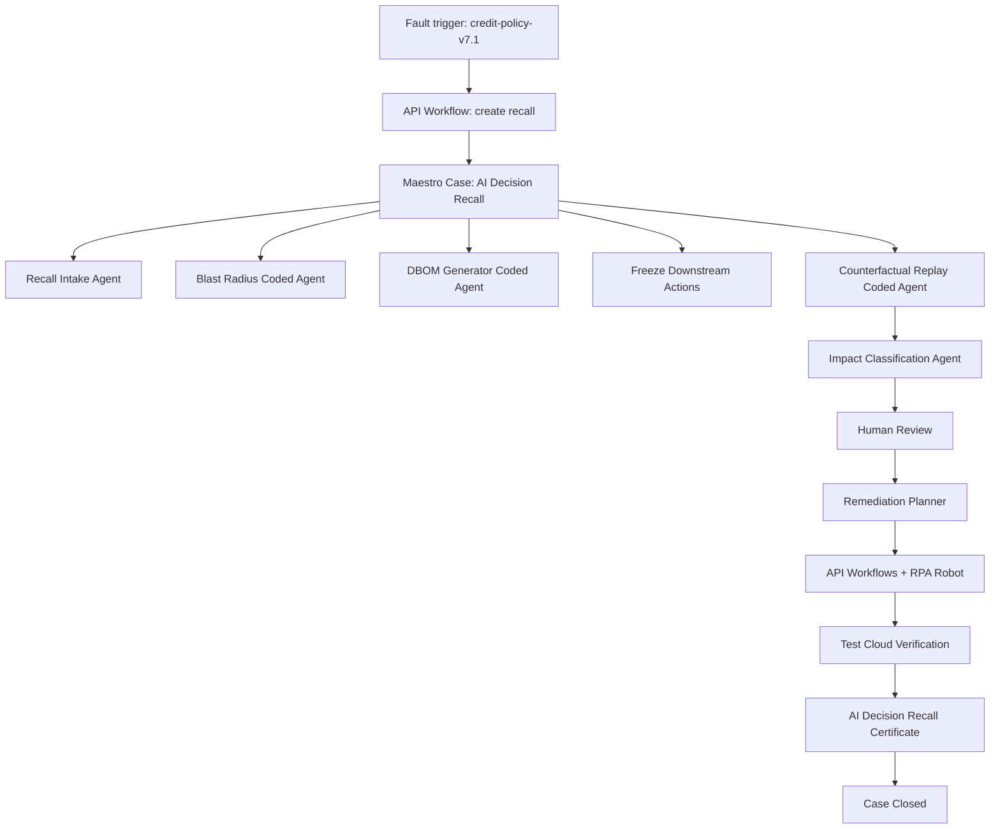

# RecallOS: Product Recall for AI Decisions

RecallOS is a UiPath AgentHack prototype for **Track 1: UiPath Maestro Case**.
It treats a faulty AI agent, prompt, policy, model, or data source like a
product recall: find every historical decision affected by the faulty
component, generate a Decision Bill of Materials, freeze downstream actions,
replay decisions under corrected logic, route human review, execute
remediation, verify the fix, and close with an audit-ready certificate.

## Demo Scenario

Northstar SME Lending discovers that `credit-policy-v7.1` incorrectly rejected
low-revenue applicants even when they had an approved guarantee. RecallOS
creates an AI Decision Recall Case for `RECALL-2026-001`.

Stable demo truth table:

| Metric | Value |
| --- | ---: |
| Historical decisions scanned | 120 |
| Decisions using `credit-policy-v7.1` | 64 |
| Changed outcomes after corrected replay | 11 |
| Immediate reopen cases | 7 |
| Customer email correction drafts | 5 |
| Remediation actions completed | 44 |

The hero case is `APP-1042 / DEC-2026-00421`: it was originally rejected, but
under corrected policy v7.2 it becomes `manual_review`.

## UiPath Components Used

| UiPath capability | RecallOS role |
| --- | --- |
| Maestro Case | Main orchestration control plane and persistent case lifecycle |
| Agent Builder | Recall intake, impact classification, customer communication, audit summary |
| Coded Agents | Blast radius, DBOM generation, counterfactual replay, remediation planning |
| API Workflows | Search, freeze, remediation execution, audit registration |
| RPA Robot | Legacy portal and compliance register update simulation |
| Test Cloud | Recall verification gate before closure |
| Orchestrator | Folder, assets, queues, storage buckets, process execution |
| Data Service / Data Fabric | Decision, DBOM, replay, remediation, audit case state |
| UiPath for Coding Agents | Codex-assisted scaffolding, tests, docs, and demo artifacts |

## Use Of Coding Agents

We used Codex to assist with coded-agent scaffolding, JSON validation,
Test Cloud-style test generation, UiPath API workflow contracts, frontend
implementation, README/deployment documentation, and review-driven hardening.
Generated code was human-reviewed, edited, tested, and integrated into the
working RecallOS prototype.

Evidence is available in `docs/coding-agent-evidence/`.

## Architecture



## Quick Start

Prerequisites: Python 3.9+ and a modern browser. No external packages are
required for the local prototype.

```bash
python3 scripts/generate_seed_data.py
python3 scripts/run_recall_case.py --write-app-data --simulate-first-test-failure
python3 -m unittest discover -s tests
python3 scripts/validate_all.py
```

Open the static control tower:

```bash
cd app
python3 -m http.server 8765 --bind 127.0.0.1
```

Then visit `http://127.0.0.1:8765/`.

After GitHub Pages is enabled from `main` / `docs`, the hosted Control Tower
will be available at:

```text
https://xiaodouzi666.github.io/RecallOS/control-tower/
```

For a single backend validation command that exercises seed data, coded agents,
mock API workflows, the robot simulation, evidence manifest generation, risk
scoring, and the end-to-end case runner, use:

```bash
python3 scripts/validate_all.py
```

## Run Individual Agents

```bash
python3 coded-agents/blast-radius-agent/agent.py --component-id credit-policy-v7.1
python3 coded-agents/dbom-generator-agent/agent.py --decision-id DEC-2026-00421
python3 coded-agents/counterfactual-replay-agent/agent.py --decision-id DEC-2026-00421
python3 coded-agents/remediation-planner-agent/agent.py
```

## Run Mock API Workflows

```bash
python3 api-workflows/search-decisions-by-component/workflow.py
python3 api-workflows/freeze-downstream-actions/workflow.py
python3 api-workflows/remediation-execution/workflow.py
python3 api-workflows/audit-register/workflow.py
```

## Repository Map

```text
docs/                 Product, architecture, DBOM, demo, judging, deployment docs
docs/control-tower/   GitHub Pages copy of the static demo UI
seed-data/            Deterministic applications, decisions, components, truth tables
coded-agents/         Four runnable coded-agent CLIs
agent-builder/        Low-code Agent Builder prompt and output contracts
api-workflows/        Mock API workflow entrypoints and contracts
maestro/              Case schema, stage contracts, rework/SLA rules
maestro/*.bpmn        Full BPMN 2.0 recall process with human and exception loops
robots/               Legacy portal and compliance register robot simulation
testcloud/            Test Cloud-style test plan and cases
app/                  Static Recall Control Tower UI
scripts/              Seed generation and end-to-end demo runner
tests/                Local verification suite
deck/                 Submission deck outline and PPTX artifact
```

## Review-driven Hardening

- Test Cloud-style verification now includes TC-01 through TC-10.
- Case rework timeline shows failed verification, re-entered planning, rerun
  remediation, and final passed verification.
- Evidence manifest covers the final closure timeline event.
- Certificate hash semantics use a final certificate artifact hash stored in
  the evidence manifest, while the certificate itself references the manifest.
- Closure guard explicitly requires passed verification, final approval,
  certificate artifact existence, and an evidence manifest hash.
- Human review supports `approved`, `needs_more_evidence`, and `revise_plan`
  branches.
- Evidence Chain tab shows SHA-256 hashes and manifest hash.
- Dependency Graph tab shows faulty component propagation.
- Risk & Exposure tab shows deterministic risk bands and exposure.
- Remediation actions include idempotency keys, cross-rerun idempotency state,
  retry metadata, rollback notes, skipped-action counts, and dry-run preview
  counts.
- Skipped remediation actions are safe idempotent rerun skips after the
  intentional Test Cloud failure; the original 44 remediation actions were
  already completed.

## Official Submission Fit

The Devpost submission should include:

- Track: UiPath Maestro Case
- Public GitHub repository with this README and MIT license
- Demo video under 5 minutes
- Presentation deck
- Working prototype running in UiPath Automation Cloud
- Description of UiPath components, low-code agents, coded agents, and coding-agent usage

See `docs/uipath-deployment-guide.md` and `docs/submission-checklist.md` for
the manual cloud and Devpost steps. See `docs/uipath-cloud-evidence.md` for
the live UiPath package, deployment, and successful job evidence captured for
this submission.

## Safety and Limitations

- The local prototype uses deterministic policy code for financial outcomes.
  LLM-style agents are used only for classification, explanation, drafting, and
  summaries.
- Customer communication is draft-only; no real email is sent.
- This is audit-ready workflow evidence, not legal advice or a complete
  compliance product.
- Public GitHub publishing and UiPath Automation Cloud evidence have been
  completed for the submission package.
- Video upload, Devpost video-link entry, and the final Devpost submit action
  still require project-owner account action.
