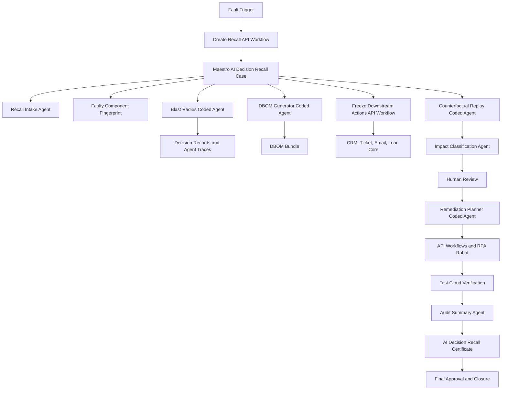

# Architecture

RecallOS is designed around Maestro as the case orchestration control plane.
Coded agents perform deterministic analysis, Agent Builder agents produce
structured explanations and drafts, API Workflows handle system integration,
and a robot covers legacy portal updates.

## Runtime Layers

| Layer | Implementation |
| --- | --- |
| Case orchestration | `maestro/case-schema.json`, `maestro/stage-contracts.md`, `maestro/rules.md` |
| Full BPMN process | `maestro/recallos-ai-decision-recall.bpmn` |
| Coded agents | `coded-agents/*/agent.py` plus shared `recallos_core` |
| API workflows | `api-workflows/*/workflow.py` |
| Legacy automation | `robots/legacy-loan-portal/robot_update_register.py` |
| Verification | `tests/test_recallos.py`, `testcloud/test-plan.md` |
| Demo UI | `app/index.html` |

## Cloud Deployment Mapping

The local CLI scripts are the reference implementations for UiPath components:

- Package coded agents as UiPath coded agents or Python-backed processes.
- Convert API workflow scripts into Studio Web API workflows with the same input
  and output JSON contracts.
- Implement Maestro stages using the stage contracts and rules.
- Store DBOM bundles and certificates in Orchestrator storage buckets.
- Bind Test Cloud test cases to the local assertions in `tests/test_recallos.py`.
